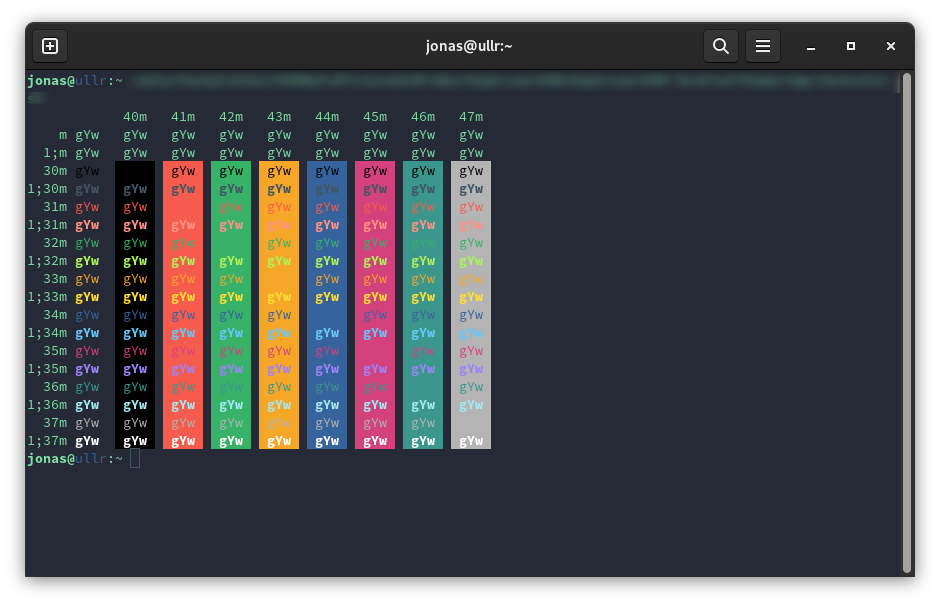

# SuperuserKAM - Terminal Theme

This color scheme was created to match with the `SuperuserKAM` keycap design by [FreshFromTheGrave](https://geekhack.org/index.php?topic=108326.0%3Futm_source%3Dkeycapsets) and should give you the possibility to configure your terminal accordingly.

## Installation
We support the installation of the theme with the following terminals.
- [Windows Terminal](https://github.com/JSchmiegel/SuperuserKAM-TerminalTheme/wiki/Installation-Guide:-Windows-Terminal)
- [iTerm2](https://github.com/JSchmiegel/SuperuserKAM-TerminalTheme/wiki/Installation-Guide:-iTerm2)
- [Gnome Terminal](https://github.com/JSchmiegel/SuperuserKAM-TerminalTheme/wiki/Installation-Guide:-Gnome-Terminal)

Installation guides can be found in the [wiki](https://github.com/JSchmiegel/ColorSchemeSuperuserKAM/wiki)

## VS Code Theme
If you are excited about the theme, you can find a theme for VS Code in the following repository: [SuperupserKAM VS Code Theme]()

## Open for suggestions and improvements
If you have any suggestions for improvements or even want to participate on the theme by adding a semantic highlighting I am open for any pull requests.
