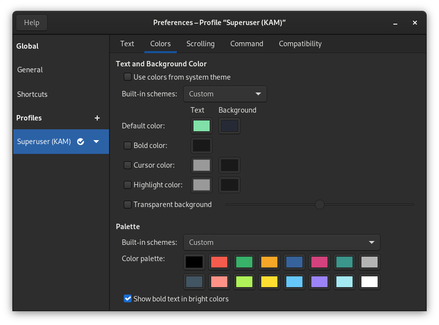

# Color scheme matching the Superuser KAM switches

This color scheme was created to match the Superuser KAM switches (https://geekhack.org/index.php?topic=108326.0%3Futm_source%3Dkeycapsets (Last access: 24.04.2021)) and should give you the possibility to configure your terminal accordingly.

# Gnome Terminal

Just create a new profile and adjust the colors (you can find the hex values in `ColorScheme.txt`) accordingly.

# Windows Terminal
Simply insert the `WindowsTerminalColorTheme.json` as color scheme.